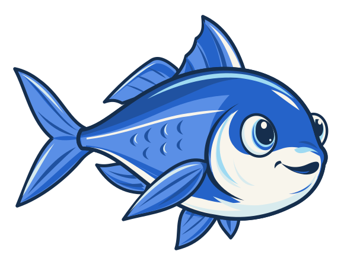
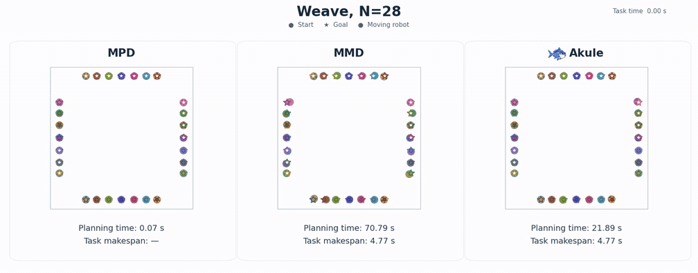
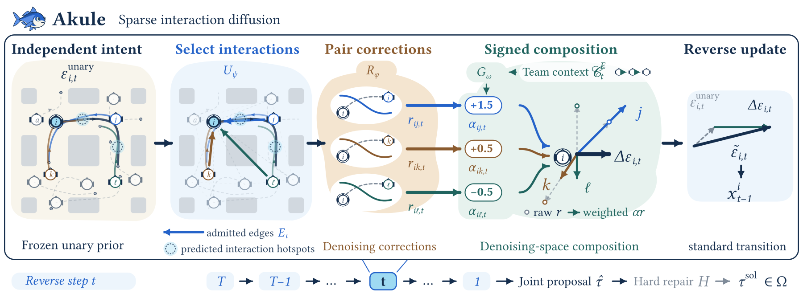

<div align="center">


# Akule: Fast and Scalable Multi-Robot Motion Planning via Sparse Interaction Diffusion

**Learn which interactions to evaluate—and how to combine them.**

[Project website](https://akule-diff.github.io/) · [Installation](docs/INSTALLATION.md) · [Benchmarks](docs/BENCHMARKS.md) · [Model assets](checkpoints/README.md)

*Anonymous research release accompanying the submitted AAMAS paper.*

<a href="https://akule-diff.github.io/#demos"></a>

Canonical Weave · 28 robots · MPD / MMD / Akule · [Explore the animation gallery →](https://akule-diff.github.io/#demos)
</div>

## Overview

Individually plausible robot trajectories can collide when planned together. Akule coordinates a team by separating two learned decisions:

1. **Which interactions should be evaluated?** The contextual selector **U** chooses a directed interaction graph before the expensive pairwise model runs.
2. **How should corrections be combined?** The composer **G** uses team context to assign signed weights to the selected corrections.

A **frozen single-robot diffusion prior** supplies motion, a reusable **pairwise residual R** supplies interaction corrections, and downstream **hard repair** validates and repairs the resulting joint proposal. Shared parameters and symmetric aggregation support variable team sizes and permutation equivariance.



## Main findings

The submitted paper reports **up to 25× complete-planner speedup**, zero-shot population transfer, and successful planning with **up to 256 robots**.

| Benchmark | Population | Akule success | Akule planning | MMD-xECBS planning |
|---|---:|---:|---:|---:|
| Canonical Weave | 10 | 512/512 | 3.128 s | 12.180 s |
| Canonical Weave | 20 | 256/256 | 7.106 s | 33.424 s |
| Canonical Weave | 28 | 512/512 | 29.944 s | 82.909 s |

One Weave coordination model is trained at N=28 and evaluated unchanged at N=20 and N=10. Planning times include repair and average over all attempts. On the four SMD map families, Akule solves **595/600** instances. The paper reports **8/10** successful ScaledWeave tasks at N=256. Published SMD/DGD baseline timings are not same-hardware comparisons.

On the Weave ablation panel, mean pre-repair conflicts fall from **94.2** with uniform summation to **32.1** with learned selection and composition. Sparse coordination trades computation against time-limited success in the most congested settings; see the paper for the full comparisons.

## Installation

Linux, **Python 3.9**, and an NVIDIA CUDA GPU are the reference environment. CPU proposal inference is available for SMD, Highways, and Conveyor. Rendering additionally requires FFmpeg.

```bash
GIT_LFS_SKIP_SMUDGE=1 git clone https://github.com/akule-diff/Akule.git
cd Akule
uv sync --locked --extra test
source .venv/bin/activate
```

For an existing Python 3.9 environment:

```bash
pip install torch==2.7.0 --index-url https://download.pytorch.org/whl/cu128
pip install -e '.[test]'
```

The pinned MMD/MPD runtime and required dependency source are included under `external/mmd/`, with upstream licenses intact. No separate research repository is needed. See [installation and troubleshooting](docs/INSTALLATION.md).

## Download checkpoints

```bash
python scripts/download_checkpoints.py --all
# Or download a benchmark and its shared dependencies:
python scripts/download_checkpoints.py --env weave
python scripts/download_checkpoints.py --env smd
python scripts/download_checkpoints.py --env highways
python scripts/download_checkpoints.py --env conveyor
python scripts/download_checkpoints.py --env scaledweave
```

The downloader checks archive sizes and SHA256 digests before extraction. Versioned archives contain final inference weights, model metadata, and required native normalization assets. Shared models are stored once. See the [checkpoint manifest](checkpoints/manifest.json).

## Quickstart

Generate and repair a saved Canonical Weave scene:

```bash
python scripts/evaluate.py --env weave --n 28 --mode sparse --repair
```

A small CPU example:

```bash
python scripts/evaluate.py --env basic --n 3 --mode sparse \
  --device cpu --output outputs/basic
```

Compare the proposal modes using the same frozen scene:

```bash
python scripts/evaluate.py --env weave --n 28 --mode unary --output outputs/unary
python scripts/evaluate.py --env weave --n 28 --mode dense --output outputs/dense
python scripts/evaluate.py --env weave --n 28 --mode sparse --output outputs/sparse
```

Each run saves a scene, metrics, and available trajectory arrays. Without `--repair`, the command evaluates the diffusion proposal. With `--repair`, it invokes the benchmark-specific downstream planner and records its outcome. A successfully executed command does not imply that a planner solved the scene: inspect `success` and the native status.

## Running benchmarks

| Environment | Saved populations | Interaction pathway |
|---|---|---|
| `weave` | 10, 20, 28 | Full reverse-diffusion rollout |
| `basic`, `dense`, `shelf`, `room` | 3, 6, 9, 12, 15, 18 | Full reverse-diffusion rollout |
| `highways`, `conveyor` | 3, 6, 9, 12, 15, 20 | Selected independent candidates, one correction at t=0 |
| `scaledweave` | 40, 64, 100, 128, 256 | Scaled-frame proposal inference |

```bash
python scripts/evaluate.py --env highways --n 3 --mode sparse --repair --output outputs/highways
python scripts/evaluate.py --env conveyor --n 3 --mode sparse --repair --output outputs/conveyor
python scripts/evaluate.py --env shelf --n 18 --mode sparse --repair --output outputs/shelf
python scripts/evaluate.py --env scaledweave --n 40 --mode sparse --output outputs/scaledweave
```

Use `--scene path/to/scene.json` to load another saved configuration. Full panel inputs and benchmark-specific details are described in [benchmark reproduction](docs/BENCHMARKS.md). Canonical Weave and ScaledWeave are distinct geometric families.

## Visualize

```bash
python scripts/visualize.py --trajectory outputs/basic/proposal.npz \
  --scene outputs/basic/scene.json --output outputs/basic/trajectory.mp4
```

The renderer reads recorded physical trajectories; it does not regenerate a plan. The [website](https://akule-diff.github.io/#demos) contains the complete public animation gallery.

## Training

The release includes canonical G transition/rollout training, U target generation and supervised training, and physical teacher-generation source. Retraining requires separately prepared teacher corpora and, for optional ORCA guides, RVO2. These are separate from the inference installation. See [training overview](docs/TRAINING.md) for executable entry points, required inputs, and the R/U/G training sequence.

## Repository structure

```text
akule/                 Portable inference bindings
scripts/               Evaluation, download, rendering, and training entry points
diffuser/models/       Unary adapters, pairwise residual, selector, composer
diffuser/utils/        Physical codecs, collision metrics, teacher objectives
configs/               Frozen normalization and benchmark contracts
benchmarks/            Saved scene and panel configurations
checkpoints/           Versioned archive and model manifests
integrations/          Benchmark-specific repair runtime
external/mmd/          Pinned MMD/MPD and dependencies, with upstream licenses
tests/                 Model, geometry, codec, saved-scene, and download tests
docs/                  Installation, benchmarks, training, and validation
assets/                Logo, architecture, and a compact animation
```

## Documentation

[Installation](docs/INSTALLATION.md) · [Benchmarks](docs/BENCHMARKS.md) · [Architecture](docs/ARCHITECTURE.md) · [Training](docs/TRAINING.md) · [Validation](docs/VALIDATION.md) · [Third-party notices](docs/THIRD_PARTY.md)

## Citation

```bibtex
@misc{akule2027,
  title = {Akule: Fast and Scalable Multi-Robot Motion Planning
           via Sparse Interaction Diffusion},
  author = {Anonymous},
  year = {2027},
  note = {Submitted to AAMAS. Anonymous research release}
}
```

## License and acknowledgments

Code retains the existing [MIT license](LICENSE). MMD, MPD, Torch Robotics, Motion Planning Baselines, and Experiment Launcher retain their own licenses and copyright notices. The SMD native collision contract follows the released SMD implementation. See [third-party notices](docs/THIRD_PARTY.md) for source attribution and dependency boundaries.
